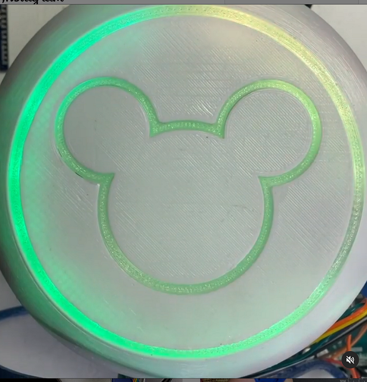

# Magic Band Reader controller for Arduino 

The purpose of this project is to automate control of other devices utilizing a Disney Magic Band. This project was created with the purpose of enabling fans like you to be able to bring some disney magic into your home thru a simple to use magic band reader. We encourage you to learn from this as well as provide feedback for us to improve upon it.

## Follow Me

[![alt text][1.1]][1]  [![alt text][2.1]][2]  [![alt text][3.1]][3]

[1.1]: images/instagram.png (Instagram - dominick_civitano)
[2.1]: images/github.png (Github - dcivitano)
[3.1]: images/tiktok.png (Tiktok - domthebuilder)
[1]: https://www.instagram.com/dominick_civitano/
[2]: https://www.github.com/dcivitano/
[3]: https://www.tiktok.com/@domthebuilder

### Actual Use:

## Getting Started
It will be helpful but not necessary if you have a basic level of programming experience as well as a little experience programming Arduino micro controllers. This project was created using the Aurduino IDE. Clone or download this repository at your own risk.

You can download the 3D printable magic band casing on Thingiverse:

Link: [Thingiverse Disney World MagicBand reader v2](https://www.thingiverse.com/thing:4460759)

### Prerequisites
* Some experience with [Arduino](https://www.arduino.cc/)

* Be sure to have the Arduino board installed in your environment.
* Install the [Adafruit_Neopixel](https://github.com/adafruit/Adafruit_NeoPixel) library
* Install the [SoftwareSerial](https://github.com/PaulStoffregen/SoftwareSerial) library
* Install the [DFRobotDFPlayerMini](https://github.com/DFRobot/DFPlayer-Mini-mp3) library
* An Arduino
* A 1K resistor
* A 5V arduino relay
* A Neopixel LED strip
* A RFID reader
* A DFPlayer Mini
* An AC extension cord (preferably a single outlet)
* A speaker

(See BOM below for details)

### Installing

1. In the Arduino IDE be sure to set the appropriate board (Arduino Nano) and ports to match your environment.
2. Complile and load onto your Arduino following the Arduino IDE [instructions(https://www.arduino.cc/en/Guide)].

Successful installation will result in the RFID reader being able to read a magic band which will be shown thru the arduino Serial Monitor. Code edits will be required to allow for successful access to your specific magic band for control of the outlet and a response from the reader with lights and sounds.

## Breadboard Diagram

## BOM

Most components can be found on [Amazon](https://www.amazon.com/) or [AliExpress](https://www.aliexpress.com/)
* Arduino (mega, uno, nano etc.)
* Mini MP3 Audio module ([DFPlayer-mini](https://www.amazon.com/gp/product/B07Y2YKYRS/ref=ppx_yo_dt_b_asin_image_o06_s00?ie=UTF8&psc=1)) 
* 5V relay standard arduino ([relay](https://www.amazon.com/gp/product/B07BVXT1ZK/ref=ppx_yo_dt_b_asin_title_o01_s00?ie=UTF8&psc=1 ))
* jumper wires both male to male and male to female
* LED strip (NeoPixel or other brand)
* 1 K ohm resistor
* Speaker
* RFID reader (Rc255-FROM [ALI EXPRESS](https://www.aliexpress.com/item/1005001543022507.html?spm=a2g0o.productlist.0.0.2228e5c2ludWkE&algo_pvid=4a07b899-7219-49a6-9ee4-7fc097820709&algo_expid=4a07b899-7219-49a6-9ee4-7fc097820709-12&btsid=0bb0623c16053672112166469e25d3&ws_ab_test=searchweb0_0,searchweb201602_,searchweb201603_ ))
*

